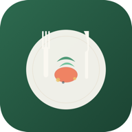

<p align="center">
  
</p>

<h1 align="center">Priprema Obroka</h1>

<p align="center">
  Multi-user meal preparation PWA for planning weekly meals, sharing shopping lists,<br/>and dividing prep tasks between household members. Built from a Serbian nutritionist's weekly meal plan.
</p>

<p align="center">
  <a href="https://n-pilipovic.github.io/meal-prep/">
    
  </a>
</p>

## Features

- **Daily & weekly views** — 5 meals/day with ingredient lists and recipes, swipe gestures for day navigation
- **Cooking mode** — step-by-step recipe tracking with Wake Lock API to keep screen on, auto-scroll to current step, large readable text for kitchen use
- **Multi-user households** — create or join with a 6-character invite code, each member has their own meal plan, switch between members' plans via user switcher
- **Shared shopping list** — aggregated ingredients across all users with quantity summing, scope toggle (today/week), filter (all/mine), per-user assignment, category grouping, source tracking (which user & meal)
- **Prep checklist** — daily preparation divided between users at 3 levels (by plan, by meal, by item), each level independently assignable
- **Meal plan editor** — edit meals/ingredients/recipes, import from .docx (Mammoth), export/import JSON, assign plans to specific users
- **AI plan generator** — 7 age groups (including BLW 6-12 months with baby-safe guidelines), 9 dietary restrictions, 12 common allergens + custom allergens, preferred/avoided ingredients, calorie slider, free-text notes; dual AI provider (Gemini primary, Groq fallback)
- **Push notifications** — daily summary at 7:00 + per-meal reminders 30 min before each meal (6 cron triggers via Cloudflare Workers), per-user preference toggles
- **Offline-first** — localStorage persistence, 30-second background sync polling, visibility change detection, optimistic updates with graceful offline degradation
- **PWA** — installable on iOS and Android, auto-update banner when a new version is available
- **Install prompts** — step-by-step iOS overlay in Safari, native Android install prompt via beforeinstallprompt API
- **Accessibility** — ARIA labels and live regions, semantic HTML, screen reader support, skip navigation, dedicated a11y test suites
- **Firebase auth** — email/password authentication with JWT verification in Cloudflare Worker

## Tech Stack

| Layer | Technology |
|-------|-----------|
| Framework | Angular v21 (standalone components, signals) |
| Styling | TailwindCSS v4 (CSS-based config) |
| Auth | Firebase Authentication |
| Backend | Cloudflare Workers + KV |
| AI | Gemini 2.5 Flash (primary), Groq LLaMA 3.3 70B (fallback) |
| Push | Web Push API with VAPID (native Web Crypto, no npm deps) |
| PWA | @angular/pwa (service worker, manifest) |
| Tests | Vitest (unit), Playwright (E2E — iPhone 14, iPhone 13 Mini, desktop) |
| Hosting | GitHub Pages |
| CI/CD | GitHub Actions (Angular deploy + Cloudflare Worker deploy) |

## Development

```bash
npm install
npx ng serve                    # Dev server at localhost:4200
npx ng test --watch=false       # Unit tests (142 tests)
npx playwright test             # E2E tests (306 tests across 3 devices)
```

### Cloudflare Worker

```bash
cd cf-worker
npm install
npm run dev                     # Local worker at localhost:8787
npm run deploy                  # Deploy to Cloudflare
```

## Project Structure

```
src/app/
  core/
    models/          # WeeklyPlan, Household, SharedState, MealType (5 types)
    services/        # MealData, Household, Api, Sync, ShoppingList, Notification, PwaUpdate
    guards/          # Onboarding guard
    interceptors/    # Auth interceptor (Firebase JWT)
  features/
    onboarding/      # Create/join household
    daily-view/      # Home — meal cards + day navigation + swipe gestures
    meal-detail/     # Ingredients + recipe instructions + cooking mode
    weekly-view/     # 7-day overview grid
    shopping-list/   # Aggregated ingredients, assignable, filterable by scope/user
    prep-checklist/  # Daily prep with 3-level division
    editor/          # Meal plan editor + .docx import + AI plan generator
    settings/        # Notifications, household, PWA install
  shared/
    components/      # BottomNav, DayNavigator, UserAvatar, UserSwitcher,
                     # MealTypeBadge, AssignmentBadge, iOS/Android install prompts,
                     # PWA update banner
    pipes/           # Quantity formatting

cf-worker/           # Cloudflare Worker (API + push notifications)
  src/
    index.ts         # Routes + cron handler
    push.ts          # Notification scheduling
    web-push.ts      # VAPID/Web Push implementation
    kv-helpers.ts    # KV read/write utilities
```

## API Endpoints

| Method | Route | Purpose |
|--------|-------|---------|
| POST | `/api/household` | Create household |
| POST | `/api/household/:code/join` | Join household |
| GET | `/api/me/household` | Get current user's household |
| GET | `/api/household/:code` | Get household info |
| PUT | `/api/user/:id/plan` | Save meal plan |
| GET | `/api/household/:code/plans` | Get all household plans |
| POST | `/api/user/:id/subscription` | Save push subscription |
| DELETE | `/api/user/:id/subscription` | Remove push subscription |
| PUT | `/api/user/:id/notification-prefs` | Save notification preferences |
| GET | `/api/household/:code/shared` | Get shared state |
| PUT | `/api/household/:code/shared` | Update shared state |
| POST | `/api/generate-plan` | Generate AI meal plan |

## Multi-User Architecture

```
Household "ABC123"
  ├── Ivana  → weekly plan (seed plan auto-assigned)
  ├── Novica → weekly plan
  ├── Shared Shopping List (combined from all plans)
  └── Shared Prep Checklist (divisible: byItem > byMeal > byUserPlan)
```

All data stored in Cloudflare KV. No database needed.

## Deployment

### GitHub Pages + Cloudflare Worker

Both deploy automatically via GitHub Actions on push to `main`:
- **Angular app** — builds, runs unit + E2E tests, deploys to GitHub Pages
- **Cloudflare Worker** — deploys via Wrangler using `CLOUDFLARE_API_TOKEN` secret

### Initial Cloudflare Setup

```bash
cd cf-worker
npx wrangler login
npx wrangler kv namespace create KV        # Update wrangler.toml with ID
npx web-push generate-vapid-keys
npx wrangler secret put VAPID_PUBLIC_KEY
npx wrangler secret put VAPID_PRIVATE_KEY
npx wrangler secret put GEMINI_API_KEY     # https://aistudio.google.com/apikey
npx wrangler secret put GROQ_API_KEY       # https://console.groq.com/keys (fallback)
npm run deploy
```

Add `CLOUDFLARE_API_TOKEN` to GitHub repo secrets (Settings → Secrets → Actions) for CI/CD.

Update `src/environments/environment.prod.ts` with the worker URL after deploying.

## Language

All UI text is in **Serbian** (Latin script). Meal types: dorucak, uzina, rucak, uzina 2, vecera.
